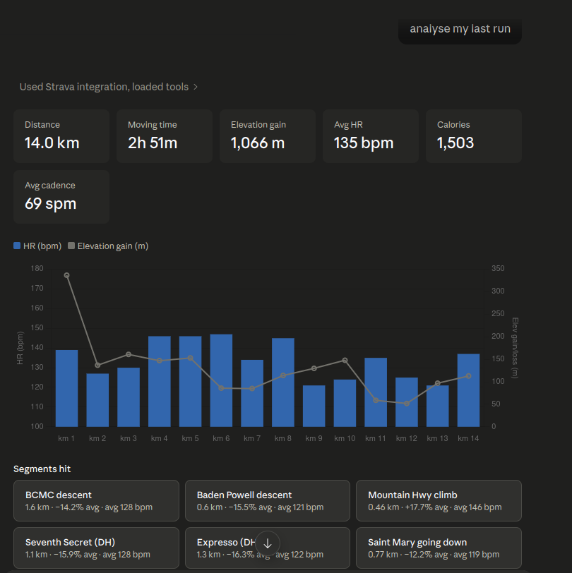

Solid effort yesterday — this is a proper mountain outing. Here's the breakdown:

**Overview**
14 km with 1,066 m of gain on the North Vancouver trails (start near Mosquito Creek trailhead area, up to ~862 m). Moving time 2h 51m, so effectively no stopped time at all. Shoes were the HOKA Speedgoats with 57 km on them — well broken in.

**Heart rate**
Avg 135 bpm, max 167 bpm. The 167 spike was on the first km — that big initial climb (337 m of gain in km 1 alone). Once on descents your HR dropped nicely into the 119–128 range, showing good aerobic base and efficient downhill mechanics. The Mountain Highway climb (17.7% avg grade) pushed you to 146 bpm but you held it steady. Nothing alarming.

**Effort distribution**
The first 4 km were essentially all climbing — 1,066 m total, with the bulk in the opening and middle sections. Cadence dropped to 59–61 spm on the steep ascents vs 76–86 on flatter/downhill terrain, which is normal for technical vert.

**Pacing**
Km 1 was effectively a power hike at 0.65 m/s — entirely appropriate given 33%+ gradient sections. Best descent speeds were km 8 (2.25 m/s, ~7:24/km pace) and km 14 (2.22 m/s). No PRs — the app flagged zero segment achievements, which likely reflects this being your first logged effort on some of these trails here rather than a slow day.

**One thing to note**
Cadence on the climbs was on the lower side (39–49 spm on the descent segments used for hiking). If you're building toward faster trail running, short-step high-cadence hiking on steep terrain is worth experimenting with — it tends to be more economical over time.

Great way to shake the legs out after the move to Vancouver.